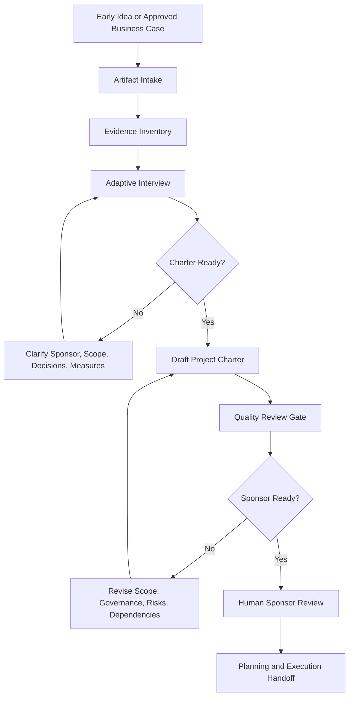

# Project Charter Initiation Agent

A PMBOK® Guide-aligned, agent-assisted project initiation system for developing sponsor-ready project charters from approved business cases, early project ideas, notes, spreadsheets, project plans, CSVs, Word documents, stakeholder inputs, and source artifacts.

This repository is designed in two layers:

1. **GitHub repository layer** - for discovery, explanation, examples, sample outputs, workflow diagrams, and public portfolio review.
2. **ChatGPT Project runtime layer** - the flat folder a user uploads into a ChatGPT Project to actually run the workflow.

> **Use in ChatGPT:** upload only the files inside [`chatgpt-project/`](chatgpt-project/). Do not upload the full repository.

## Status

Public portfolio prototype. Designed for ChatGPT Project use, sponsor review, and workflow demonstration. Not a SaaS product, autonomous approval engine, or substitute for sponsor authorization, delivery planning, finance review, or governance approval.

## How to evaluate this repo

Open these first:

- [`chatgpt-project/`](chatgpt-project/) for the flat ChatGPT runtime.
- [`examples/sample-data/`](examples/sample-data/) for synthetic intake and source artifacts.
- [`examples/sample-outputs/`](examples/sample-outputs/) for generated Markdown, HTML, DOCX, and quality-review outputs.
- [`quality-review/`](quality-review/) for review gates and critique.

Evaluate the repo on whether it turns approved intent into clear authorization, scope, ownership, governance rhythm, risks, dependencies, assumptions, open decisions, and planning handoff.

## Before and after example

Before: a project has enough intent to start moving, but scope, sponsor authority, decision rights, success measures, constraints, dependencies, and change-control rules are still scattered or implied.

After: the work is framed as a sponsor-ready charter that defines why the project exists, what is authorized, who owns decisions, what is in and out of scope, what must be governed, and how the project moves into planning and execution.

## Compact workflow diagram

GitHub renders the workflow below directly from Mermaid. A rendered PDF is also included for offline review or portfolio sharing.



- [View the rendered workflow PDF](workflow/project_charter_initiation_workflow.pdf)
- [View the Mermaid source](workflow/project_charter_initiation_workflow.mmd)

## What this project does

Project Charter Initiation Agent helps a human move from an early project concept or approved business case into an initiation-ready project charter. It behaves like a senior project initiation and governance advisor. It interviews the user, ingests source artifacts, challenges weak framing, and produces polished outputs in Markdown, HTML, and DOCX.

The system helps clarify:

- Why the project exists
- What business outcome it supports
- Who sponsors and owns it
- What is in scope and out of scope
- What deliverables are authorized
- What success measures will be used
- What assumptions and constraints govern the work
- What risks, dependencies, and open decisions must be managed
- What governance rhythm, escalation path, and change-control model will be used
- What milestone path moves the project from initiation into planning and execution

## What this project does not do

This is not a generic template library, a fake SaaS platform, or an autonomous approval engine. It does not replace sponsor judgment, finance review, technical review, delivery planning, or governance approval. It helps a human structure the project initiation conversation and produce a clearer charter.

The charter should not reargue the full business case. The charter establishes authorization, scope, ownership, execution guardrails, governance discipline, and the path into planning and execution.

## Who this is for

- Business owners who need to initiate a project cleanly
- Knowledge workers turning messy ideas into structured charters
- Entry-to-senior managers who need sponsor-ready framing
- Software developers and engineers who need clearer scope and decision rights
- Project managers, program managers, PMOs, and portfolio leaders
- Consultants and operations leaders building repeatable project initiation workflows

## How to use this in ChatGPT

1. Create a new ChatGPT Project.
2. Upload only the files inside [`chatgpt-project/`](chatgpt-project/).
3. Add your project notes, business case, spreadsheets, Word documents, CSVs, project plans, or stakeholder notes as source files.
4. Start with a prompt such as:

```text
I want to develop a project charter. Use the Project Charter Initiation Agent workflow. First ingest the uploaded artifacts, then ask only the highest-value missing questions before drafting.
```

5. Ask for outputs in Markdown, HTML, or DOCX.
6. Review the quality gate before treating the charter as sponsor-ready.

## Repository structure

```text
project-charter-initiation-agent/
  README.md
  AGENTS.md
  LICENSE.md
  .gitignore

  chatgpt-project/        # Flat ChatGPT runtime folder. Upload this folder's files only.
  examples/               # Synthetic sample data, prompts, and generated outputs.
  templates/              # Optional standalone templates for browsing or local use.
  tools/                  # Lightweight local validation/generation helpers.
  workflow/               # Mermaid source and rendered workflow PDF.
  quality-review/         # Rubric and self-test evidence.
```

## Runtime folder design

The [`chatgpt-project/`](chatgpt-project/) folder is the product. It is:

- Flat
- Self-contained
- Under 25 files
- Designed for operation inside ChatGPT Projects
- Focused on triggers, file-use rules, review gates, output patterns, and human-control guardrails

The rest of the repository supports public explanation, examples, GitHub discoverability, and local review.

## Example scenario included

The included fictional scenario is a customer onboarding control tower initiative. It includes dummy source artifacts, sample prompts, intake responses, generated Markdown, generated HTML, generated DOCX, and a charter quality review.

See:

- [`examples/sample-data/`](examples/sample-data/)
- [`examples/sample-prompts/`](examples/sample-prompts/)
- [`examples/sample-outputs/`](examples/sample-outputs/)

## GitHub discoverability keywords

project charter template, project initiation, PMBOK Guide aligned, PMP, project governance, project management, stakeholder register, business case, scope definition, assumptions log, risk register, dependency log, RACI, change control, sponsor approval, project manager authority, project planning, AI agent, agentic workflow, Markdown, HTML, DOCX.

## Human-control principle

The system can interview, organize, challenge, draft, and review. A human still owns project authorization, sponsor commitment, finance validation, delivery feasibility, risk acceptance, and governance approval.
